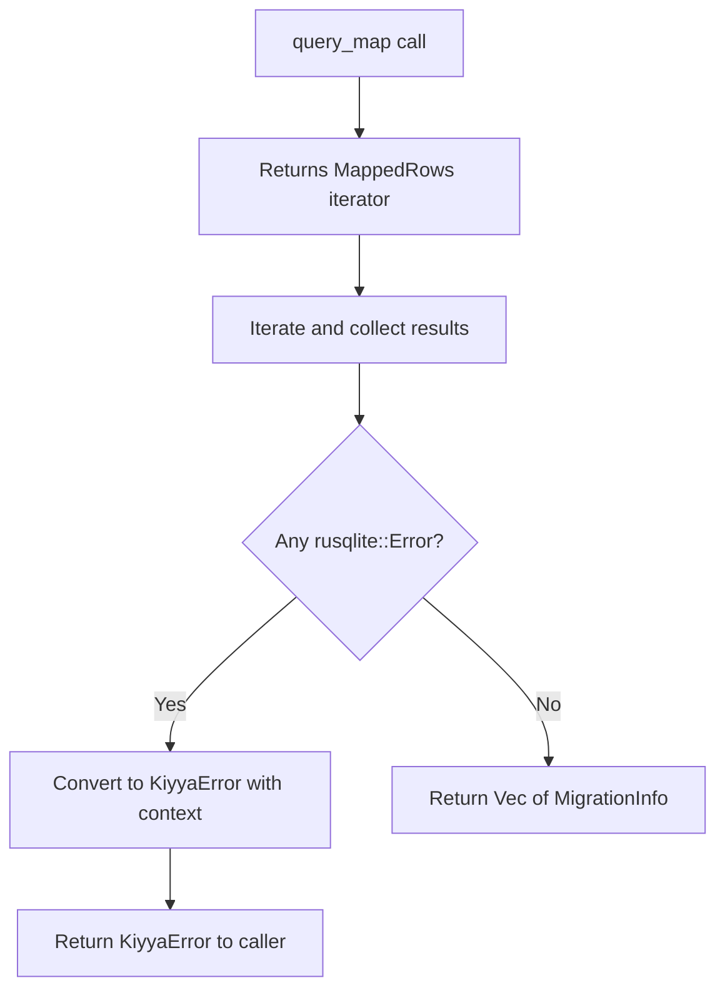

# Design Document: Fix Migrations Error Handling

## Overview

This design addresses a critical compilation error in the database migration system caused by incorrect error type conversions. The issue occurs in the `get_migration_history` method where `.with_context()` is called on results that are still within a `rusqlite::Error` context, attempting to convert them to `KiyyaError` prematurely.

The root cause is that `query_map` returns an iterator of `Result<T, rusqlite::Error>`, and calling `.with_context()` inside the iteration tries to convert individual row errors before they're collected. The solution is to defer error conversion until after the results are collected from the iterator.

## Architecture

The fix maintains the existing error handling architecture:

1. **Low-level errors** (`rusqlite::Error`) occur at the database operation level
2. **Error conversion** happens via the `ErrorContext` trait's `.with_context()` method
3. **Application errors** (`KiyyaError`) are returned to callers with rich context

The key architectural change is ensuring error conversion happens at the correct boundary - after collecting results from rusqlite iterators, not during iteration.



## Components and Interfaces

### Modified Component: `MigrationRunner::get_migration_history`

**Current Implementation (Broken):**
```rust
pub fn get_migration_history(&self, conn: &Connection) -> Result<Vec<MigrationInfo>> {
    let mut stmt = conn.prepare("SELECT ...")
        .with_context("Failed to prepare migration history query")?;
    
    let rows = stmt.query_map([], |row| {
        Ok(MigrationInfo { ... })
    }).with_context("Failed to query migration history")?;  // ❌ Converts outer error
    
    let mut history = Vec::new();
    for row in rows {
        history.push(row.with_context("...")?);  // ❌ Tries to convert inner error
    }
    Ok(history)
}
```

**Fixed Implementation:**
```rust
pub fn get_migration_history(&self, conn: &Connection) -> Result<Vec<MigrationInfo>> {
    let mut stmt = conn.prepare("SELECT ...")
        .with_context("Failed to prepare migration history query")?;
    
    let rows = stmt.query_map([], |row| {
        Ok(MigrationInfo { ... })
    }).with_context("Failed to query migration history")?;  // ✓ Converts outer error
    
    // Collect results, converting rusqlite::Error to KiyyaError
    rows.collect::<std::result::Result<Vec<_>, _>>()
        .with_context("Failed to parse migration history rows")
}
```

**Interface:**
- **Input:** `&Connection` - Database connection reference
- **Output:** `Result<Vec<MigrationInfo>>` - List of applied migrations or error
- **Error Conditions:**
  - Query preparation fails
  - Query execution fails
  - Row parsing fails (missing columns, type mismatches)

### Error Conversion Flow

The `ErrorContext` trait provides two methods:

```rust
trait ErrorContext<T> {
    fn with_context(self, context: &str) -> Result<T>;
    fn with_context_fn<F>(self, f: F) -> Result<T> where F: FnOnce() -> String;
}
```

Implementation for `Result<T, E> where E: Into<KiyyaError>`:
- Converts error `E` to `KiyyaError` using `Into` trait
- Wraps in `KiyyaError::Internal` with context message
- Preserves original error message

## Data Models

### MigrationInfo Structure

```rust
#[derive(Debug, Clone)]
pub struct MigrationInfo {
    pub version: u32,
    pub description: String,
    pub applied_at: i64,
    pub checksum: Option<String>,
}
```

**Field Mapping from Database:**
- `version` ← Column 0 (INTEGER)
- `description` ← Column 1 (TEXT, with COALESCE for old schemas)
- `applied_at` ← Column 2 (INTEGER, Unix timestamp)
- `checksum` ← Column 3 (TEXT, nullable)

### Error Type Hierarchy

```
rusqlite::Error (from rusqlite crate)
    ↓ (via Into trait)
KiyyaError::Database(rusqlite::Error)
    ↓ (via with_context)
KiyyaError::Internal { message: String }
```

## Implementation Strategy

### Step 1: Modify Error Handling in `get_migration_history`

Replace the manual iteration and error conversion with a single `.collect()` call that handles error conversion uniformly:

**Before:**
```rust
let mut history = Vec::new();
for row in rows {
    history.push(row.with_context("Failed to parse migration history row")?);
}
Ok(history)
```

**After:**
```rust
rows.collect::<std::result::Result<Vec<_>, _>>()
    .with_context("Failed to parse migration history rows")
```

### Step 2: Verify Type Consistency

Ensure the error type chain is consistent:
1. `stmt.query_map()` returns `Result<MappedRows<F>, rusqlite::Error>`
2. `.with_context()` converts to `Result<MappedRows<F>, KiyyaError>`
3. Iterating `MappedRows<F>` yields `Result<MigrationInfo, rusqlite::Error>`
4. `.collect()` produces `Result<Vec<MigrationInfo>, rusqlite::Error>`
5. `.with_context()` converts to `Result<Vec<MigrationInfo>, KiyyaError>`

### Step 3: Maintain Fallback Query Logic

The method has fallback logic for old database schemas:

```rust
let query_result = conn.prepare("SELECT version, COALESCE(description, ''), ...");
let mut stmt = match query_result {
    Ok(s) => s,
    Err(_) => {
        // Fallback for old schema
        conn.prepare("SELECT version, '', applied_at, NULL FROM migrations ...")?
    }
};
```

This logic remains unchanged - the fix only affects error handling after query execution.


## Correctness Properties

*A property is a characteristic or behavior that should hold true across all valid executions of a system—essentially, a formal statement about what the system should do. Properties serve as the bridge between human-readable specifications and machine-verifiable correctness guarantees.*

### Property 1: Error Message Preservation

*For any* `rusqlite::Error` that is converted to `KiyyaError` using `.with_context()`, the resulting error message should contain both the context string and the original error message from the rusqlite error.

**Validates: Requirements 2.3**

### Property 2: Complete Migration History Retrieval

*For any* database with N applied migrations, calling `get_migration_history()` should return exactly N `MigrationInfo` records with all metadata fields populated correctly.

**Validates: Requirements 3.2**

## Error Handling

### Error Scenarios

1. **Query Preparation Failure**
   - **Cause:** Invalid SQL syntax or database connection issues
   - **Handling:** Convert to `KiyyaError::Internal` with context "Failed to prepare migration history query"
   - **Recovery:** Not recoverable - indicates database corruption or connection failure

2. **Query Execution Failure**
   - **Cause:** Database locked, I/O error, or constraint violation
   - **Handling:** Convert to `KiyyaError::Internal` with context "Failed to query migration history"
   - **Recovery:** Potentially recoverable with retry

3. **Row Parsing Failure**
   - **Cause:** Type mismatch, missing column, or NULL in non-nullable field
   - **Handling:** Convert to `KiyyaError::Internal` with context "Failed to parse migration history rows"
   - **Recovery:** Not recoverable - indicates schema mismatch or data corruption

### Error Context Strategy

The fix uses a two-level error context strategy:

1. **Outer context** (query execution): Applied to the `query_map` result
2. **Inner context** (row parsing): Applied to the collected results

This ensures errors at different stages have appropriate context while maintaining type consistency.

## Testing Strategy

### Unit Tests

Unit tests will verify specific scenarios and edge cases:

1. **Compilation Success Test**
   - Verify the application compiles without errors
   - Check that no type conversion errors exist in migrations.rs
   - **Validates: Requirements 1.1**

2. **Error Context Tests**
   - Test that query failures include "Failed to query migration history" context
   - Test that row parsing failures include "Failed to parse migration history rows" context
   - **Validates: Requirements 2.1, 2.2**

3. **Migration Execution Test**
   - Apply migrations to a fresh database
   - Verify all migrations execute successfully
   - **Validates: Requirements 3.1**

4. **Backward Compatibility Test**
   - Test against databases with old schema (no description/checksum columns)
   - Verify fallback query logic works correctly
   - **Validates: Requirements 3.3**

### Property-Based Tests

Property tests will verify universal behaviors across many inputs:

1. **Property Test: Error Message Preservation**
   - Generate various rusqlite errors
   - Convert each to KiyyaError with context
   - Verify original message is preserved in all cases
   - **Minimum 100 iterations**
   - **Tag: Feature: fix-migrations-error-handling, Property 1: Error Message Preservation**
   - **Validates: Requirements 2.3**

2. **Property Test: Complete Migration History Retrieval**
   - Generate databases with random numbers of applied migrations (0-50)
   - Query migration history
   - Verify returned count matches applied count
   - Verify all metadata fields are populated
   - **Minimum 100 iterations**
   - **Tag: Feature: fix-migrations-error-handling, Property 2: Complete Migration History Retrieval**
   - **Validates: Requirements 3.2**

### Testing Approach

- **Unit tests** focus on specific error scenarios and integration points
- **Property tests** verify universal correctness across many generated inputs
- Both approaches are complementary and necessary for comprehensive coverage
- Property tests use a minimum of 100 iterations to ensure thorough randomized testing
- Each property test references its corresponding design property via comment tags
