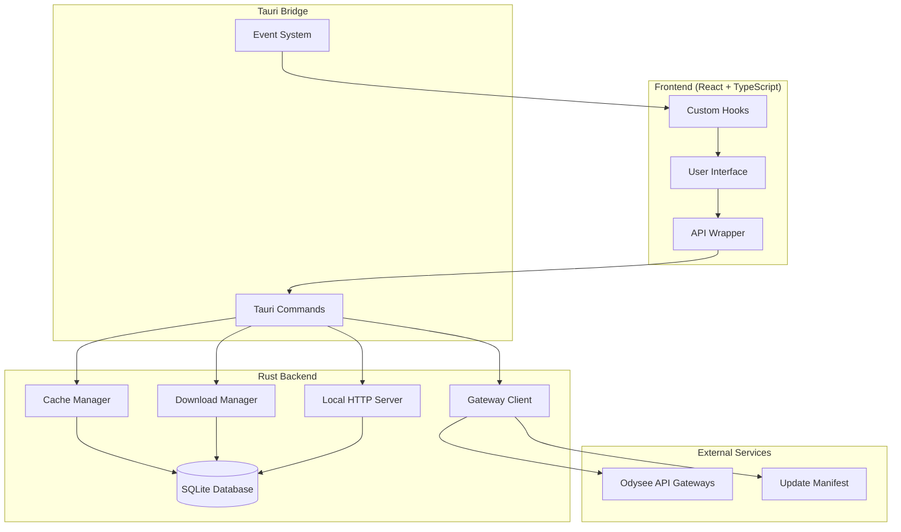

# Design Document: Kiyya Desktop Streaming Application

## Overview

Kiyya is a desktop streaming application built using Tauri framework, combining a Rust backend with a React + TypeScript frontend. The application provides access to content from a single Odysee channel with local caching, offline downloads, and a cinematic user interface.

### Key Design Principles

- **Single Source of Truth**: All content originates from one configured Odysee channel
- **Offline-First**: Local caching and download capabilities for uninterrupted access
- **Resilient Architecture**: Gateway failover and defensive error handling
- **Performance-Oriented**: Lazy loading, efficient caching, and resource management
- **Accessibility-Compliant**: Full keyboard navigation and screen reader support
- **Security-Focused**: Restricted network/filesystem access and optional encryption

### Technology Stack

- **Backend**: Tauri (Rust) with reqwest for HTTP, rusqlite for database, warp for local HTTP server
- **Frontend**: Vite + React + TypeScript + Tailwind CSS + GSAP (limited animations)
- **Video**: Plyr wrapper with hls.js fallback for HLS streams
- **Database**: SQLite for local data persistence
- **Testing**: Vitest (unit), Playwright (E2E), property-based testing integration

## Hard-Coded Tags (Authoritative)

The application uses these exact tag strings throughout the codebase. These tags are authoritative and must not be modified:

### Base Tags
- `series` - Identifies series content
- `movie` - Identifies movie content  
- `sitcom` - Identifies sitcom content
- `kids` - Identifies kids content
- `hero_trailer` - Identifies hero/trailer content for homepage display

### Category Filter Tags
- `comedy_movies` - Comedy movies filter
- `action_movies` - Action movies filter
- `romance_movies` - Romance movies filter
- `comedy_series` - Comedy series filter
- `action_series` - Action series filter
- `romance_series` - Romance series filter
- `comedy_kids` - Comedy kids content filter
- `action_kids` - Action kids content filter

These tags drive all discovery logic, NavBar dropdowns, and content categorization throughout the application.

## Architecture

### High-Level Architecture



### Component Interaction Flow

1. **Content Discovery**: Frontend requests content → Gateway Client fetches from Odysee → Cache Manager stores locally
2. **Video Playback**: User selects video → Claim resolution → Quality selection → Player initialization
3. **Downloads**: User initiates download → Download Manager streams content → Optional encryption → Local storage
4. **Offline Playback**: User plays downloaded content → Local HTTP Server streams → Player receives local URL

## NavBar Dropdown → Odysee Fetch Flow

The NavBar component and content fetching follow a strict separation of concerns:

### NavBar Behavior
- **Dropdown Display**: NavBar reads category configuration to render dropdown menus
- **Navigation Only**: Clicking dropdown items routes to category pages (e.g., `/movies?filter=action_movies`)
- **No Direct API Calls**: NavBar never calls Odysee APIs directly

### Category Page Fetch Flow
1. **Route Handling**: Category page receives filter parameter from URL
2. **API Call**: Page component calls `fetch_channel_claims({ any_tags: [baseTag, filterTag] })`
3. **Content Display**: Results are displayed in the category page layout
4. **Cache Integration**: Local cache is checked first, remote fetch as fallback

### Example Flow
```
User clicks "Action" in Movies dropdown
→ Navigate to /movies?filter=action_movies
→ MoviesPage component reads filter parameter
→ Calls fetch_channel_claims({ any_tags: ["movie", "action_movies"] })
→ Displays filtered movie content
```

## Related Content Fetch

When a MovieDetail or Episode page opens, the system automatically fetches related content:

### Related Content Rules
- **Quantity**: Fetch 10 random items from the same category tag
- **Exclusion**: Exclude the currently playing claimId from results
- **Caching**: Cache related results for the current session only
- **Display**: Show as "You may also like" or similar recommendation section

### Implementation Flow
1. **Tag Extraction**: Parse current content tags to identify category tag (e.g., `action_movies`)
2. **Fetch Related**: Call `fetchByTag(categoryTag, limit: 50)`
3. **Randomization**: Shuffle results and select up to 10 items
4. **Filtering**: Remove current content from recommendations
5. **Session Cache**: Store results in memory for session duration

## Components and Interfaces

### Frontend Components

#### Core UI Components

**NavBar Component**
- Renders category navigation from configuration
- Implements dropdown menus with keyboard accessibility
- Routes to category pages without direct API calls
- Provides breadcrumb navigation

**Hero Component**
- Fetches and displays random hero_trailer content
- Implements GSAP animations (respecting prefers-reduced-motion)
- Handles autoplay with muted fallback to poster
- Provides CTA buttons for play and favorites

**RowCarousel Component**
- Displays content in horizontal scrollable rows
- Implements lazy loading with IntersectionObserver
- Handles loading states and error conditions
- Supports infinite scroll for large collections

**MovieCard Component**
- Displays content poster with 2:3 aspect ratio
- Shows title, duration, and quality indicators
- Implements hover animations and accessibility
- Handles missing thumbnails gracefully
- **Accessibility**: All `` elements must use `alt={title}` attribute
- **Thumbnail Fallback**: Playlist thumbnails default to first episode thumbnail

**PlayerModal Component**
- Wraps Plyr video player with custom controls
- Implements quality selection and progress tracking
- Handles HLS fallback and codec compatibility
- Manages fullscreen and keyboard shortcuts
- **Accessibility**: All `` elements must use `alt={title}` attribute

#### Specialized Components

**SeriesPage Component**
- Organizes episodes by season using playlist data
- Implements expandable season sections
- Falls back to title parsing when playlists unavailable
- Shows "inferred seasons" notices when appropriate

**DownloadsPage Component**
- Lists active and completed downloads
- Shows progress bars and download speeds
- Provides delete and play actions
- Handles offline content management

**ForcedUpdateScreen Component**
- Displays full-screen update requirement
- Blocks all other functionality when triggered
- Provides only "Update" and "Exit" options
- Handles external browser opening for downloads

### Backend Components

#### Gateway Client

**Interface**
```rust
pub struct GatewayClient {
    gateways: Vec<String>,
    current_gateway: usize,
    retry_config: RetryConfig,
}

impl GatewayClient {
    pub async fn fetch_with_failover(&mut self, request: ApiRequest) -> Result<ApiResponse, GatewayError>;
    pub fn log_gateway_health(&self, gateway: &str, success: bool, response_time: Duration);
}
```

**Responsibilities**
- Manages multiple Odysee API endpoints with prioritization
- Implements exponential backoff with jitter (300ms → 1s → 2s)
- Logs gateway performance and failures to dedicated log file
- Provides diagnostic information to frontend

#### Cache Manager

**Interface**
```rust
pub struct CacheManager {
    db: SqliteConnection,
    ttl_config: TtlConfig,
}

impl CacheManager {
    pub async fn get_cached_content(&self, query: CacheQuery) -> Result<Vec<ContentItem>, CacheError>;
    pub async fn store_content(&self, items: Vec<ContentItem>) -> Result<(), CacheError>;
    pub async fn run_migrations(&self) -> Result<(), MigrationError>;
}
```

**Responsibilities**
- Manages SQLite database with versioned migrations
- Implements TTL-based cache invalidation (default 30 minutes)
- Provides efficient querying with proper indexing
- Handles cache size limits and cleanup

#### Download Manager

**Interface**
```rust
pub struct DownloadManager {
    vault_path: PathBuf,
    encryption_enabled: bool,
    progress_sender: EventSender,
}

impl DownloadManager {
    pub async fn download_content(&self, request: DownloadRequest) -> Result<DownloadResult, DownloadError>;
    pub async fn check_disk_space(&self, required_bytes: u64) -> Result<bool, IoError>;
    pub async fn resume_download(&self, partial_file: PathBuf) -> Result<DownloadResult, DownloadError>;
}
```

**Responsibilities**
- Streams content with resumable download support
- Checks disk space before starting downloads
- Implements optional AES-GCM encryption
- Emits progress events to frontend

#### Local HTTP Server

**Interface**
```rust
pub struct LocalServer {
    port: u16,
    vault_path: PathBuf,
    active_streams: HashMap<String, StreamHandle>,
}

impl LocalServer {
    pub async fn start(&mut self) -> Result<u16, ServerError>;
    pub async fn serve_content(&self, uuid: &str, range: Option<Range>) -> Result<StreamResponse, ServerError>;
    pub fn decrypt_stream(&self, encrypted_path: &Path, range: Range) -> Result<ByteStream, CryptoError>;
}
```

**Responsibilities**
- Serves downloaded content via HTTP with Range support
- Handles concurrent client connections
- Decrypts content on-the-fly for encrypted downloads
- Returns proper HTTP status codes (200, 206, 416)

### Tauri Command Interface

#### Content Commands
```typescript
// Frontend API wrapper
export interface TauriAPI {
  fetchChannelClaims(params: {
    any_tags?: string[];
    text?: string;
    limit?: number;
    page?: number;
  }): Promise<ContentItem[]>;
  
  fetchPlaylists(): Promise<Playlist[]>;
  
  resolveClaim(claimIdOrUri: string): Promise<ClaimMetadata>;
}
```

#### Download Commands
```typescript
export interface DownloadAPI {
  downloadMovieQuality(params: {
    claimId: string;
    quality: string;
    url: string;
  }): Promise<void>;
  
  streamOffline(params: {
    claimId: string;
    quality: string;
  }): Promise<{ url: string; port: number }>;
  
  deleteOffline(params: {
    claimId: string;
    quality: string;
  }): Promise<void>;
}
```

#### Progress and Settings Commands
```typescript
export interface StateAPI {
  saveProgress(params: {
    claimId: string;
    positionSeconds: number;
    quality: string;
  }): Promise<void>;
  
  getProgress(claimId: string): Promise<ProgressData | null>;
  
  getAppConfig(): Promise<AppConfig>;
  
  getDiagnostics(): Promise<DiagnosticsData>;
}
```

## Data Models

### Content Models

#### ContentItem
```typescript
interface ContentItem {
  claimId: string;
  title: string;
  description?: string;
  tags: string[];
  thumbnailUrl?: string;
  duration?: number;
  releaseTime: number;
  videoUrls: Record<string, VideoUrl>;
  compatibility: CompatibilityInfo;
}

interface VideoUrl {
  url: string;
  quality: string;
  type: 'mp4' | 'hls';
  codec?: string;
}

interface CompatibilityInfo {
  compatible: boolean;
  reason?: string;
  fallbackAvailable: boolean;
}
```

#### Series and Playlist Models
```typescript
interface Playlist {
  id: string;
  title: string;
  claimId: string;
  items: PlaylistItem[];
  seasonNumber?: number;
  seriesKey?: string;
}

interface PlaylistItem {
  claimId: string;
  position: number;
  episodeNumber?: number;
  seasonNumber?: number;
}

interface SeriesInfo {
  seriesKey: string;
  title: string;
  seasons: Season[];
  totalEpisodes: number;
}

interface Season {
  number: number;
  episodes: Episode[];
  playlistId?: string;
  inferred: boolean;
}
```

### Database Schema

#### SQLite Tables

**favorites**
```sql
CREATE TABLE favorites (
  claimId TEXT PRIMARY KEY,
  title TEXT NOT NULL,
  thumbnailUrl TEXT,
  insertedAt INTEGER NOT NULL
);
```

**progress**
```sql
CREATE TABLE progress (
  claimId TEXT PRIMARY KEY,
  positionSeconds INTEGER NOT NULL,
  quality TEXT NOT NULL,
  updatedAt INTEGER NOT NULL
);
```

**offline_meta**
```sql
CREATE TABLE offline_meta (
  claimId TEXT NOT NULL,
  quality TEXT NOT NULL,
  filename TEXT NOT NULL,
  fileSize INTEGER NOT NULL,
  encrypted BOOLEAN DEFAULT FALSE,
  addedAt INTEGER NOT NULL,
  PRIMARY KEY (claimId, quality)
);
```

**local_cache**
```sql
CREATE TABLE local_cache (
  claimId TEXT PRIMARY KEY,
  title TEXT NOT NULL,
  titleLower TEXT NOT NULL,
  description TEXT,
  descriptionLower TEXT,
  tags TEXT NOT NULL,
  thumbnailUrl TEXT,
  videoUrls TEXT NOT NULL,
  compatibility TEXT NOT NULL,
  updatedAt INTEGER NOT NULL
);
```

**playlists**
```sql
CREATE TABLE playlists (
  id TEXT PRIMARY KEY,
  title TEXT NOT NULL,
  claimId TEXT NOT NULL,
  seasonNumber INTEGER,
  seriesKey TEXT,
  updatedAt INTEGER NOT NULL
);
```

**playlist_items**
```sql
CREATE TABLE playlist_items (
  playlistId TEXT NOT NULL,
  claimId TEXT NOT NULL,
  position INTEGER NOT NULL,
  episodeNumber INTEGER,
  seasonNumber INTEGER,
  PRIMARY KEY (playlistId, claimId),
  FOREIGN KEY (playlistId) REFERENCES playlists(id)
);
```

**migrations**
```sql
CREATE TABLE migrations (
  version INTEGER PRIMARY KEY,
  applied_at INTEGER NOT NULL
);
```

#### Database Indices
```sql
CREATE INDEX idx_localcache_titleLower ON local_cache(titleLower);
CREATE INDEX idx_localcache_tags ON local_cache(tags);
CREATE INDEX idx_progress_updatedAt ON progress(updatedAt);
CREATE INDEX idx_playlist_items_position ON playlist_items(playlistId, position);
```

### Configuration Models

#### Application Configuration
```typescript
interface AppConfig {
  theme: 'dark' | 'light';
  lastUsedQuality: string;
  encryptDownloads: boolean;
  autoUpgradeQuality: boolean;
  cacheTtlMinutes: number;
  maxCacheItems: number;
  vaultPath: string;
  version: string;
  gateways: string[];
}
```

#### Category Configuration
```typescript
interface CategoryConfig {
  movies: CategoryDefinition;
  series: CategoryDefinition;
  sitcoms: CategoryDefinition;
  kids: CategoryDefinition;
}

interface CategoryDefinition {
  label: string;
  baseTag: string;
  filters: FilterDefinition[];
}

interface FilterDefinition {
  label: string;
  tag: string;
}
```

### Update System Models

#### Version Manifest
```typescript
interface VersionManifest {
  latestVersion: string;
  minSupportedVersion: string;
  releaseNotes: string;
  downloadUrl: string;
  checksums?: Record<string, string>;
}
```

#### Update State
```typescript
interface UpdateState {
  status: 'checking' | 'current' | 'optional' | 'forced' | 'error';
  currentVersion: string;
  latestVersion?: string;
  minSupportedVersion?: string;
  releaseNotes?: string;
  downloadUrl?: string;
  lastChecked?: number;
  deferredUntil?: number;
}
```

## Update Manifest Hosting

The application's update system relies on a public GitHub repository for hosting update manifests:

### Repository Structure
- **Public Repository**: `kiyya-releases` (contains only version.json and release assets)
- **Private Repository**: `all_kiyya_code` (contains all source code)
- **Manifest Location**: `https://raw.githubusercontent.com/YOURNAME/kiyya-releases/main/version.json`

### Hosting Requirements
- **Public Access**: Update manifest must be publicly accessible via HTTPS
- **No Authentication**: Runtime fetching requires no private repository access
- **GitHub Raw Content**: Fetched as raw JSON via GitHub's raw content URLs
- **Release Assets**: Binary installers hosted as GitHub Release assets (not in repository files)

### Security Considerations
- **No Source Code**: Public repository contains no application source code
- **Version Information Only**: Manifest contains only version metadata and download links
- **HTTPS Only**: All manifest fetching must use secure HTTPS connections

## Correctness Properties

*A property is a characteristic or behavior that should hold true across all valid executions of a system—essentially, a formal statement about what the system should do. Properties serve as the bridge between human-readable specifications and machine-verifiable correctness guarantees.*

### Property 1: Content Categorization Consistency
*For any* content item with valid tags, the categorization system should place it in exactly one primary category (movies, series, sitcoms, kids) based on its base tag, and the item should appear in all applicable filter subcategories.
**Validates: Requirements 1.2, 1.4**

### Property 2: Cache TTL Behavior
*For any* cached content item, if the TTL has not expired, the item should be returned from local cache without making a remote API call, and if the TTL has expired, a fresh API call should be made and the cache updated.
**Validates: Requirements 1.3, 7.6, 13.1**

### Property 3: Series Episode Ordering Preservation
*For any* series with available playlist data, the episode order in the UI should exactly match the playlist order, and when playlist data is unavailable, episodes should be ordered by parsed season/episode numbers with consistent sorting.
**Validates: Requirements 2.1, 2.3, 2.4**

### Property 4: Episode Title Parsing Consistency
*For any* episode title following the "SeriesName S01E01 - Episode Title" format, the parser should extract the correct series name, season number, and episode number, and for titles that don't match the format, the parser should return null without throwing errors.
**Validates: Requirements 2.2**

### Property 5: Adaptive Quality Management
*For any* video playback session, the initial quality should be selected based on network conditions and user preferences, and when buffering occurs repeatedly (≥3 times in 10 seconds), the quality should automatically downgrade to the next lower available quality with user notification.
**Validates: Requirements 3.2, 3.3, 3.4**

### Property 6: Claim Resolution Round Trip
*For any* valid claim ID, resolving the claim should return streaming metadata including video URLs and compatibility information, and the returned metadata should be sufficient to initiate playback or display compatibility warnings.
**Validates: Requirements 3.1, 3.6**

### Property 7: Progress Tracking Consistency
*For any* video playback session, progress should be saved at regular intervals (20-30 seconds), and when the same video is played again, the saved progress should be restored within ±2 seconds of the last saved position.
**Validates: Requirements 3.7, 7.4**

### Property 8: Download Safety Validation
*For any* download request, the system should check available disk space and require a minimum 200MB buffer beyond the estimated file size, and downloads should be aborted with clear error messages when insufficient space is available.
**Validates: Requirements 21.1, 21.2, 21.3**

### Property 9: Resumable Download Consistency
*For any* interrupted download, if the server supports Range headers, the download should resume from the last successfully written byte, and if Range headers are not supported, the download should restart from the beginning.
**Validates: Requirements 4.2, 21.5**

### Property 10: Atomic Download Operations
*For any* download operation, content should be written to a temporary file during download and atomically renamed to the final location only upon successful completion, ensuring no partial files exist in the vault directory.
**Validates: Requirements 21.6, 21.8**

### Property 11: Gateway Failover Resilience
*For any* API request, if the primary gateway fails, the system should automatically retry with the next available gateway using exponential backoff (300ms → 1s → 2s), and the system should continue functioning as long as at least one gateway is responsive.
**Validates: Requirements 6.2, 6.3, 6.5, 16.2, 16.3**

### Property 12: HTTP Range Support Compliance
*For any* Range request to the local HTTP server, the server should return a 206 Partial Content response with correct Content-Range headers for valid ranges, return 416 Range Not Satisfiable for invalid ranges, and support concurrent connections to the same content.
**Validates: Requirements 17.2, 17.3, 17.4, 17.7, 4.5**

### Property 13: Encryption Round Trip Integrity
*For any* content downloaded with encryption enabled, the encrypted file should be decryptable on-the-fly during streaming without writing decrypted content to disk, and the decrypted stream should be identical to the original content.
**Validates: Requirements 4.3, 4.6, 17.6**

### Property 14: Search Query Normalization
*For any* search query containing season/episode variations (e.g., "season one", "s1", "episode ten"), the normalization function should convert them to canonical forms (S01, E10) that match the stored title formats.
**Validates: Requirements 5.2**

### Property 15: Search Fallback Behavior
*For any* search query that returns zero results from local cache, the system should automatically query the remote API and, if still no results, should suggest recent uploads as alternatives.
**Validates: Requirements 5.1, 5.3, 5.4**

### Property 16: Input Sanitization Safety
*For any* user input used in search queries, the input should be sanitized to prevent SQL injection attacks while preserving the intended search functionality.
**Validates: Requirements 5.6**

### Property 17: Version Comparison Accuracy
*For any* two semantic version strings, the comparison function should correctly determine their relative order according to semantic versioning rules (major.minor.patch), handling edge cases like missing patch versions.
**Validates: Requirements 19.3, 8.2**

### Property 18: Forced Update Enforcement
*For any* application startup where the current version is below the minimum supported version, the system should display a full-screen forced update modal with only "Update" and "Exit" options, preventing access to any other functionality.
**Validates: Requirements 19.4, 19.5, 8.3**

### Property 19: Database Migration Safety
*For any* database schema migration, the migration should execute within a transaction and rollback completely if any step fails, preserving the original database state and logging detailed error information.
**Validates: Requirements 20.3, 20.4, 7.2**

### Property 20: Content Parsing Resilience
*For any* Odysee API response, the content parser should extract available metadata (thumbnails, video URLs, quality mappings) from multiple possible field locations and return clear error objects when parsing fails, without crashing the application.
**Validates: Requirements 14.1, 14.2, 14.3, 14.4, 1.5**

### Property 21: Codec Compatibility Detection
*For any* resolved video claim, the system should test codec compatibility using canPlayType for MP4 content and MediaSource availability for HLS content, setting appropriate compatibility flags and displaying warnings for incompatible content.
**Validates: Requirements 18.1, 18.3, 18.4, 18.5**

### Property 22: Offline Content Access Restriction
*For any* application state when offline, only downloaded content should be accessible for playback, and all remote content should be unavailable with appropriate UI indicators.
**Validates: Requirements 4.7**

### Property 23: Hero Content Session Persistence
*For any* application session, the hero content should be randomly selected once at startup from hero_trailer tagged content and remain consistent throughout the session, with autoplay attempted (muted) and fallback to poster display if autoplay fails.
**Validates: Requirements 10.1, 10.2, 10.3, 10.4, 10.6**

### Property 24: Accessibility Animation Compliance
*For any* user with prefers-reduced-motion set, all GSAP animations should be disabled and replaced with immediate state changes, ensuring full functionality without motion effects.
**Validates: Requirements 9.5**

### Property 25: Diagnostic Information Completeness
*For any* diagnostic request, the system should return comprehensive health information including gateway status, database version, free disk space, local server status, and last successful manifest fetch timestamp.
**Validates: Requirements 23.1, 23.2, 23.3**

### Property 26: Event Emission Consistency
*For any* download operation, the system should emit progress events during download, completion events on success, and error events on failure, with each event containing the appropriate payload data.
**Validates: Requirements 4.4, 15.9**

### Property 27: Security Boundary Enforcement
*For any* network request, the system should only allow connections to approved Odysee domains, and for any file system operation, access should be restricted to the application data folder.
**Validates: Requirements 12.1, 12.2**

### Property 28: Key Management Security
*For any* encryption operation, keys should be stored only in the OS keystore (never in application code or database), and users should receive explicit warnings about data loss risks when encryption is enabled.
**Validates: Requirements 22.1, 22.3, 22.5**

## Error Handling

### Error Categories and Strategies

#### Network Errors
- **Gateway Failures**: Implement automatic failover with exponential backoff
- **Timeout Handling**: 10-second timeout with one retry for non-critical operations
- **Rate Limiting**: Respect 429 responses with appropriate backoff periods
- **Offline Detection**: Graceful degradation to cached content only

#### Content Parsing Errors
- **Malformed Responses**: Defensive parsing with fallback to default values
- **Missing Fields**: Graceful handling with appropriate UI indicators
- **Invalid URLs**: Validation and fallback to alternative sources
- **Codec Issues**: Compatibility detection with user-friendly warnings

#### Storage Errors
- **Disk Space**: Pre-flight checks with clear error messages
- **Permission Issues**: Appropriate error handling with user guidance
- **Corruption**: Integrity checks with recovery mechanisms
- **Migration Failures**: Transaction rollback with detailed logging

#### Playback Errors
- **Stream Failures**: Automatic quality downgrade and retry logic
- **Codec Incompatibility**: Clear warnings with external player fallback
- **Network Interruption**: Seamless transition to offline content when available
- **Buffering Issues**: Adaptive quality adjustment with user notification

### Error Recovery Mechanisms

#### Automatic Recovery
- Gateway failover for API requests
- Quality downgrade for playback issues
- Cache fallback for network failures
- Resume capability for interrupted downloads

#### User-Initiated Recovery
- Manual refresh options for failed content loads
- Retry buttons for failed operations
- Clear cache options for persistent issues
- Debug information collection for support

#### Graceful Degradation
- Offline mode with downloaded content only
- Reduced functionality when services unavailable
- Alternative content suggestions when primary fails
- Fallback UI states for missing data

## Testing Strategy

### Dual Testing Approach

The testing strategy employs both unit testing and property-based testing as complementary approaches:

- **Unit tests**: Verify specific examples, edge cases, and error conditions
- **Property tests**: Verify universal properties across all inputs
- Both approaches are necessary for comprehensive coverage

### Unit Testing Focus Areas

Unit tests should concentrate on:
- Specific examples that demonstrate correct behavior
- Integration points between components
- Edge cases and error conditions
- Platform-specific functionality
- UI component behavior

### Property-Based Testing Configuration

Property-based tests must:
- Run minimum 100 iterations per test (due to randomization)
- Reference their corresponding design document property
- Use tag format: **Feature: kiyya-desktop-streaming, Property {number}: {property_text}**
- Cover universal properties that hold for all inputs
- Provide comprehensive input coverage through randomization

### Testing Framework Selection

#### Frontend Testing
- **Vitest**: Unit tests for React components and utility functions
- **Playwright**: End-to-end testing for user workflows
- **Property Testing**: Custom generators for content data and user interactions

#### Backend Testing
- **Rust built-in testing**: Unit tests for Tauri commands and core logic
- **Property Testing**: Using proptest crate for Rust property-based tests
- **Integration Testing**: Full command interface testing with mocked external services

### Test Coverage Requirements

#### Critical Path Coverage
- Content discovery and caching workflows
- Video playback and quality management
- Download and offline playback functionality
- Series organization and playlist handling
- Gateway failover and error recovery
- Database migrations and data integrity

#### Property Test Implementation
Each correctness property must be implemented as a single property-based test:

1. **Property 1**: Generate random content with various tag combinations
2. **Property 2**: Test cache behavior with different TTL scenarios
3. **Property 3**: Verify episode ordering with various playlist configurations
4. **Property 11**: Simulate gateway failures and verify failover behavior
5. **Property 12**: Test HTTP Range requests with various range specifications
6. **Property 17**: Test version comparison with edge cases and malformed versions

#### End-to-End Test Scenarios
- Application startup with hero content loading
- Series browsing with season expansion and episode selection
- Video playback with quality changes and progress tracking
- Download initiation, progress monitoring, and offline playback
- Search functionality with query normalization and fallback
- Update checking with forced and optional update scenarios
- Gateway failover during normal operation
- Offline mode with restricted functionality

### Continuous Integration Requirements

The CI pipeline must:
- Run all unit tests for both frontend and backend
- Execute property-based tests with sufficient iterations
- Perform headless E2E tests with mocked external services
- Validate database migrations with sample older databases
- Check code coverage thresholds for critical paths
- Verify accessibility compliance for UI components
- Test cross-platform compatibility (Windows, macOS, Linux)