# Kiyya Desktop Streaming Application - Architecture

## Table of Contents

1. [Overview](#overview)
2. [Technology Stack](#technology-stack)
3. [System Architecture](#system-architecture)
4. [Component Architecture](#component-architecture)
5. [Data Flow](#data-flow)
6. [Database Design](#database-design)
7. [Security Architecture](#security-architecture)
8. [Deployment Architecture](#deployment-architecture)
9. [Testing Architecture](#testing-architecture)

## Overview

Kiyya is a desktop streaming application built with Tauri framework, combining a Rust backend with a React + TypeScript frontend. The application provides access to content from a single Odysee channel with local caching, offline downloads, and a cinematic user interface.

### Key Architectural Principles

- **Single Source of Truth**: All content originates from one configured Odysee channel
- **Offline-First**: Local caching and download capabilities for uninterrupted access
- **Resilient Architecture**: Gateway failover and defensive error handling
- **Performance-Oriented**: Lazy loading, efficient caching, and resource management
- **Accessibility-Compliant**: Full keyboard navigation and screen reader support
- **Security-Focused**: Restricted network/filesystem access and optional encryption

## Technology Stack

### Backend (Rust)
- **Framework**: Tauri 1.x
- **HTTP Client**: reqwest with connection pooling
- **Database**: rusqlite with SQLite
- **Local Server**: warp HTTP server
- **Encryption**: AES-GCM via ring crate
- **Async Runtime**: tokio

### Frontend (TypeScript/React)
- **Build Tool**: Vite
- **UI Framework**: React 18
- **Styling**: Tailwind CSS
- **Animations**: GSAP (limited usage)
- **Video Player**: Plyr with hls.js fallback
- **Routing**: React Router
- **State Management**: React hooks + context

### Testing
- **Frontend Unit**: Vitest + React Testing Library
- **Backend Unit**: Rust built-in testing
- **Property-Based**: fast-check (TS), proptest (Rust)
- **E2E**: Playwright

## System Architecture

### High-Level Architecture Diagram

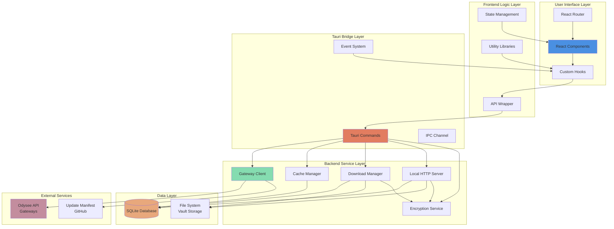

### Component Interaction Flow

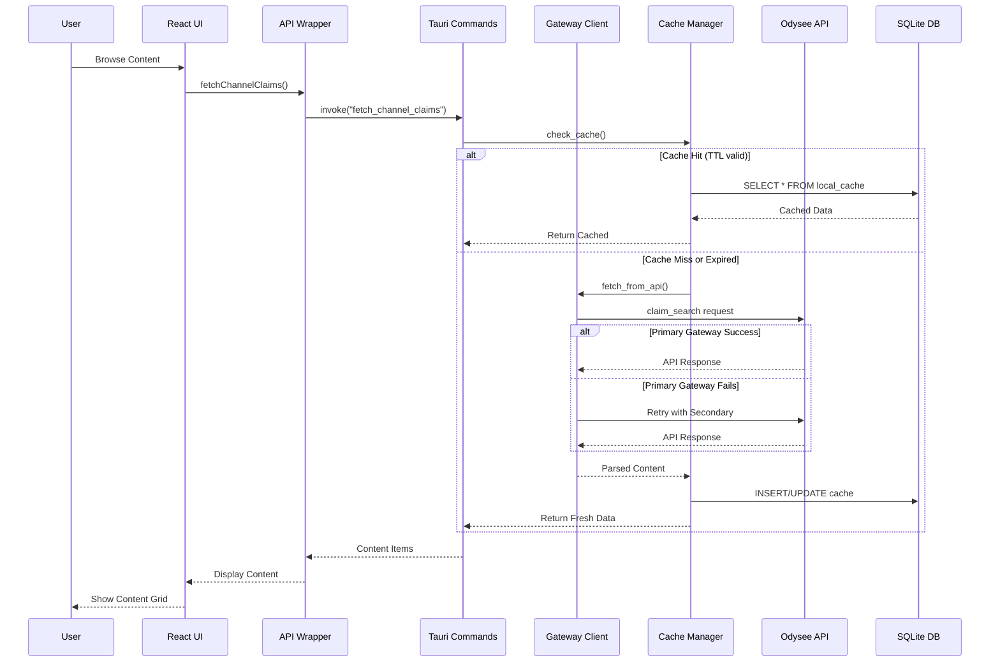

## Component Architecture

### Frontend Component Hierarchy

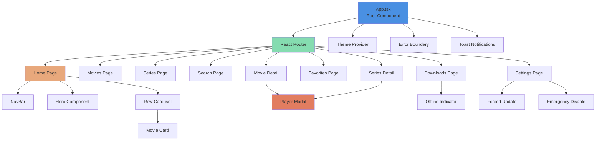

### Backend Module Architecture

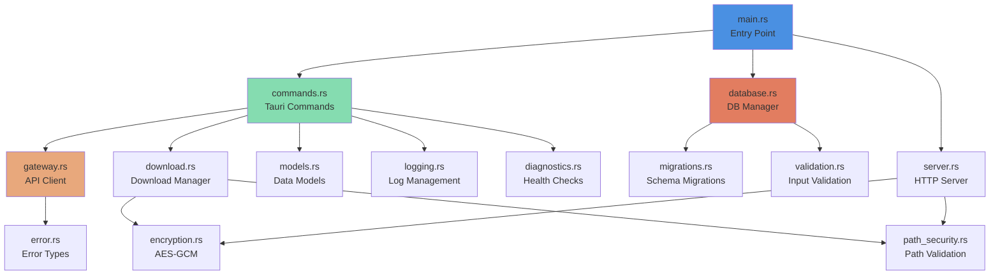

## Data Flow

### Content Discovery Flow


### Download and Offline Playback Flow

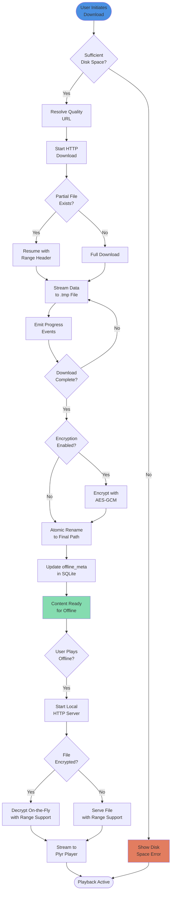

### Series Organization Flow


## Database Design

### Entity Relationship Diagram

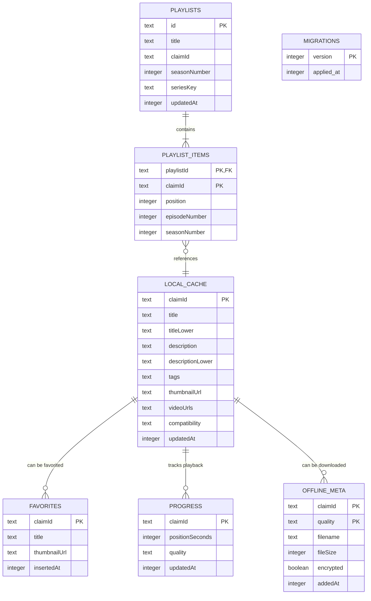

### Database Schema Details

#### Indices for Performance

```sql
-- Content search optimization
CREATE INDEX idx_localcache_titleLower ON local_cache(titleLower);
CREATE INDEX idx_localcache_tags ON local_cache(tags);
CREATE INDEX idx_localcache_updatedAt ON local_cache(updatedAt);

-- Progress tracking
CREATE INDEX idx_progress_updatedAt ON progress(updatedAt);

-- Playlist ordering
CREATE INDEX idx_playlist_items_position ON playlist_items(playlistId, position);
CREATE INDEX idx_playlists_seriesKey ON playlists(seriesKey);
```

#### Cache TTL Strategy

- **Default TTL**: 30 minutes for content metadata
- **Invalidation**: Automatic cleanup on app startup for expired entries
- **Force Refresh**: User-initiated cache bypass for immediate updates
- **Storage Limit**: Maximum 200 items in cache, LRU eviction

## Security Architecture

### Security Boundaries

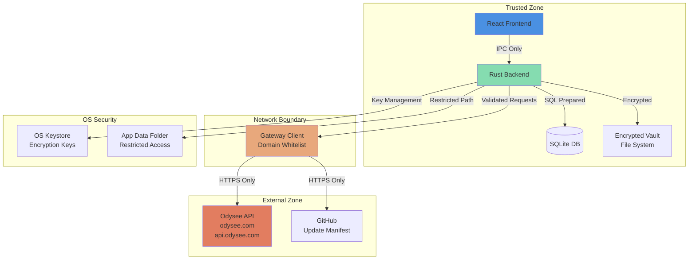

### Security Controls

#### Network Security
- **Domain Whitelist**: Only `odysee.com`, `api.odysee.com`, and update manifest URL allowed
- **HTTPS Only**: All external requests require TLS
- **No Embedded Secrets**: No API tokens or keys in application code
- **Request Validation**: All inputs sanitized before network requests

#### File System Security
- **Restricted Access**: Only application data folder accessible
- **Path Validation**: All file paths validated against directory traversal
- **Atomic Operations**: Downloads use temporary files with atomic rename
- **Encryption**: Optional AES-GCM encryption for downloaded content

#### Data Security
- **SQL Injection Protection**: All queries use prepared statements
- **Input Sanitization**: User inputs validated and sanitized
- **Key Management**: Encryption keys stored only in OS keystore
- **No Telemetry**: Zero external analytics or tracking

## Deployment Architecture

### Application Structure

```
kiyya-desktop/
├── src/                          # React frontend source
│   ├── components/               # UI components
│   ├── pages/                    # Route pages
│   ├── hooks/                    # Custom React hooks
│   ├── lib/                      # Utility libraries
│   └── types/                    # TypeScript types
├── src-tauri/                    # Rust backend source
│   ├── src/
│   │   ├── commands.rs           # Tauri commands
│   │   ├── gateway.rs            # API client
│   │   ├── database.rs           # SQLite manager
│   │   ├── download.rs           # Download manager
│   │   ├── server.rs             # Local HTTP server
│   │   └── encryption.rs         # Crypto operations
│   ├── Cargo.toml                # Rust dependencies
│   └── tauri.conf.json           # Tauri configuration
├── tests/                        # Test suites
│   ├── unit/                     # Unit tests
│   ├── property/                 # Property-based tests
│   └── e2e/                      # End-to-end tests
└── dist/                         # Build output
```

### Build and Distribution

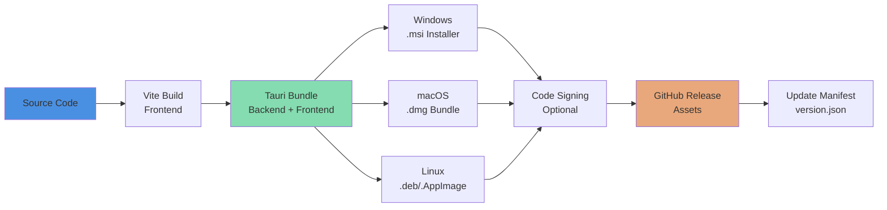

### Update Mechanism

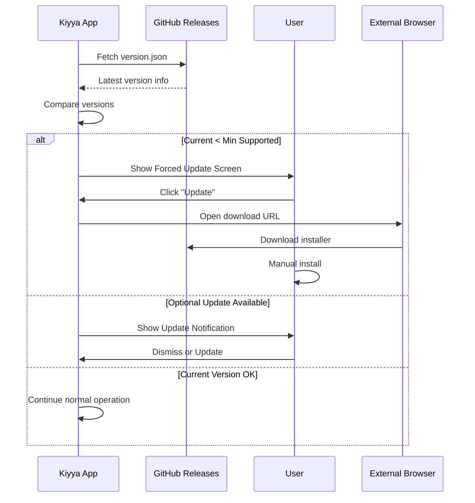

## Testing Architecture

### Test Pyramid

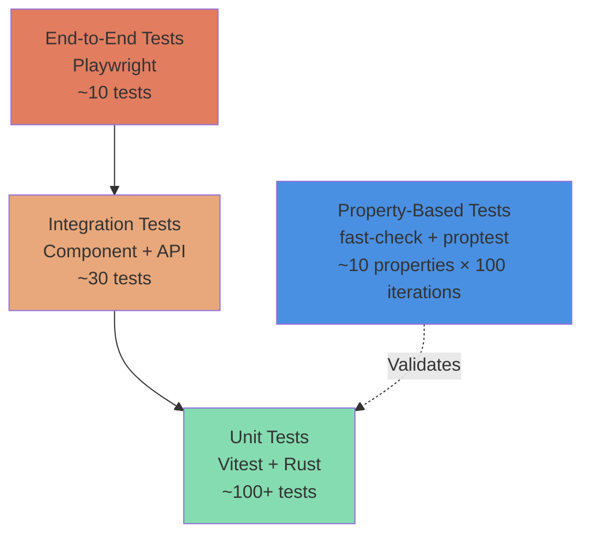

### Test Coverage Strategy

#### Frontend Testing
- **Unit Tests**: React components, hooks, utility functions
- **Property Tests**: Content categorization, search normalization, series ordering
- **E2E Tests**: User workflows, navigation, playback

#### Backend Testing
- **Unit Tests**: Tauri commands, gateway client, database operations
- **Property Tests**: Gateway failover, HTTP Range support, version comparison
- **Integration Tests**: Full command interface with mocked services

### Continuous Integration Pipeline

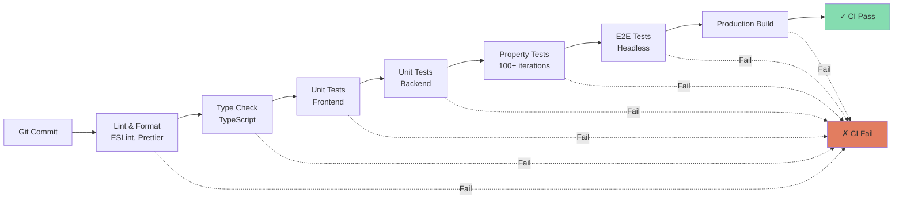

## Performance Considerations

### Frontend Optimization
- **Lazy Loading**: IntersectionObserver for content rows and images
- **Code Splitting**: Route-based code splitting with React.lazy
- **Memoization**: React.memo for expensive components
- **Debouncing**: Search input debouncing (300ms)
- **Virtual Scrolling**: For large content lists (future enhancement)

### Backend Optimization
- **Connection Pooling**: Reuse HTTP connections for API requests
- **Database Indexing**: Strategic indices on frequently queried columns
- **Async Operations**: Non-blocking I/O with tokio runtime
- **Caching Strategy**: 30-minute TTL with LRU eviction
- **Streaming Downloads**: Chunked transfer for large files

### Resource Management
- **Memory Limits**: Maximum 200 items in memory cache
- **Disk Space Checks**: Pre-flight validation before downloads
- **Idle Callbacks**: Background tasks use requestIdleCallback
- **Animation Limits**: GSAP usage restricted to hero, dropdowns, hover only

## Scalability Considerations

### Current Limitations
- **Single Channel**: Application designed for one Odysee channel
- **Local Storage**: All data stored locally, no cloud sync
- **Manual Updates**: User-initiated update process
- **No CDN**: Direct gateway access without CDN layer

### Future Enhancements
- **Multi-Channel Support**: Configuration for multiple channels
- **Cloud Sync**: Optional cloud backup for favorites and progress
- **Auto-Updates**: Background update downloads with user approval
- **CDN Integration**: Content delivery optimization
- **Playlist Sharing**: Export/import playlist functionality

## Conclusion

The Kiyya architecture prioritizes security, performance, and offline-first functionality while maintaining a clean separation between frontend and backend concerns. The Tauri framework provides a secure bridge between the React UI and Rust backend, enabling native desktop capabilities with web technologies.

Key architectural strengths:
- **Resilient**: Gateway failover and defensive error handling
- **Secure**: Restricted network/filesystem access with optional encryption
- **Performant**: Efficient caching and lazy loading strategies
- **Testable**: Comprehensive test coverage with property-based testing
- **Maintainable**: Clear component boundaries and separation of concerns

For implementation details, refer to:
- **Requirements**: `.kiro/specs/kiyya-desktop-streaming/requirements.md`
- **Design**: `.kiro/specs/kiyya-desktop-streaming/design.md`
- **Tasks**: `.kiro/specs/kiyya-desktop-streaming/tasks.md`
