# Backend Flow Diagrams

This document provides comprehensive visual representations of the Kiyya Desktop backend architecture, showing module interactions, data flow patterns, and initialization sequences.

## 1. Backend Module Interaction Diagram

## 2. Data Flow Diagram: Content Fetching Pipeline

## 3. Initialization Sequence Diagram

```mermaid
sequenceDiagram
    participant OS as Operating System
    participant MAIN as main()
    participant LOG as logging::init_logging()
    participant CRASH as crash_reporting::init()
    participant INIT as initialize_app_state()
    participant DB as Database::new()
    participant GW as GatewayClient::new()
    participant DL as DownloadManager::new()
    participant SRV as LocalServer::new()
    participant TAURI as Tauri Builder
    participant SETUP as setup hook

    OS->>MAIN: Start application
    
    Note over MAIN: === PHASE 1: Logging Setup ===
    MAIN->>LOG: Initialize logging system
    LOG->>LOG: Create log directory
    LOG->>LOG: Configure file rotation
    LOG->>LOG: Set log level from env
    LOG-->>MAIN: Ok() or continue without logging
    
    Note over MAIN: === PHASE 2: Crash Reporting ===
    MAIN->>CRASH: init_crash_reporting(app_data_path)
    CRASH->>CRASH: Create crash log directory
    CRASH->>CRASH: Set panic hook
    CRASH-->>MAIN: Ok()
    
    Note over MAIN: === PHASE 3: Emergency Disable Check ===
    Note over MAIN: ⚠️ CURRENTLY SKIPPED FOR DEBUGGING
    
    Note over MAIN: === PHASE 4: App State Initialization ===
    MAIN->>INIT: initialize_app_state()
    
    INIT->>DB: Database::new()
    DB->>DB: Get app data directory
    DB->>DB: Create database file if not exists
    DB->>DB: Create connection pool
    DB->>DB: Create base schema (tables)
    Note over DB: ⚠️ Migrations NOT run here
    DB-->>INIT: Database instance
    
    INIT->>GW: GatewayClient::new()
    GW->>GW: Initialize gateway list
    GW->>GW: Set current gateway index
    GW->>GW: Create HTTP client
    GW-->>INIT: GatewayClient instance
    
    INIT->>DL: DownloadManager::new()
    DL->>DL: Get vault directory path
    DL->>DL: Create vault directory
    DL->>DL: Initialize download state
    DL-->>INIT: DownloadManager instance
    
    INIT->>SRV: LocalServer::new()
    SRV->>SRV: Initialize server state
    SRV->>SRV: Create content registry
    SRV-->>INIT: LocalServer instance
    
    INIT->>INIT: Wrap in Arc<Mutex<>>
    INIT-->>MAIN: AppState
    
    Note over MAIN: === PHASE 5: Tauri Builder ===
    MAIN->>TAURI: tauri::Builder::default()
    MAIN->>TAURI: .manage(app_state)
    MAIN->>TAURI: .invoke_handler(commands)
    MAIN->>TAURI: .setup(setup_hook)
    
    Note over MAIN: === PHASE 6: Setup Hook ===
    TAURI->>SETUP: Execute setup hook
    Note over SETUP: ⚠️ Migrations SKIPPED for debugging
    Note over SETUP: Normal flow: run_startup_migrations()
    SETUP-->>TAURI: Ok()
    
    Note over MAIN: === PHASE 7: Run Application ===
    TAURI->>TAURI: .run(context)
    TAURI-->>OS: Application running
```

## 4. Database Migration Flow

## 5. Content Download Flow

## 6. Offline Streaming Flow

## 7. Error Handling and Logging Flow

## 8. Gateway Failover Strategy

## 9. Cache Management Flow

## 10. Module Dependency Graph

## Summary

These diagrams provide a comprehensive view of the Kiyya Desktop backend architecture:

1. **Module Interaction Diagram**: Shows how all backend modules connect and depend on each other
2. **Data Flow Diagram**: Illustrates the complete content fetching pipeline from frontend to API
3. **Initialization Sequence**: Details the exact startup sequence and component initialization order
4. **Database Migration Flow**: Shows the migration execution strategy and idempotency checks
5. **Content Download Flow**: Demonstrates the download process with encryption and error handling
6. **Offline Streaming Flow**: Shows how local server streams encrypted/unencrypted content
7. **Error Handling Flow**: Illustrates the error classification and logging strategy
8. **Gateway Failover Strategy**: Shows the multi-gateway failover state machine
9. **Cache Management Flow**: Details cache operations and TTL-based expiration
10. **Module Dependency Graph**: Shows the layered architecture and dependency hierarchy

These diagrams accurately reflect the current implementation as of the codebase stabilization audit.
